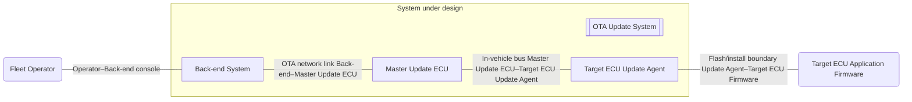
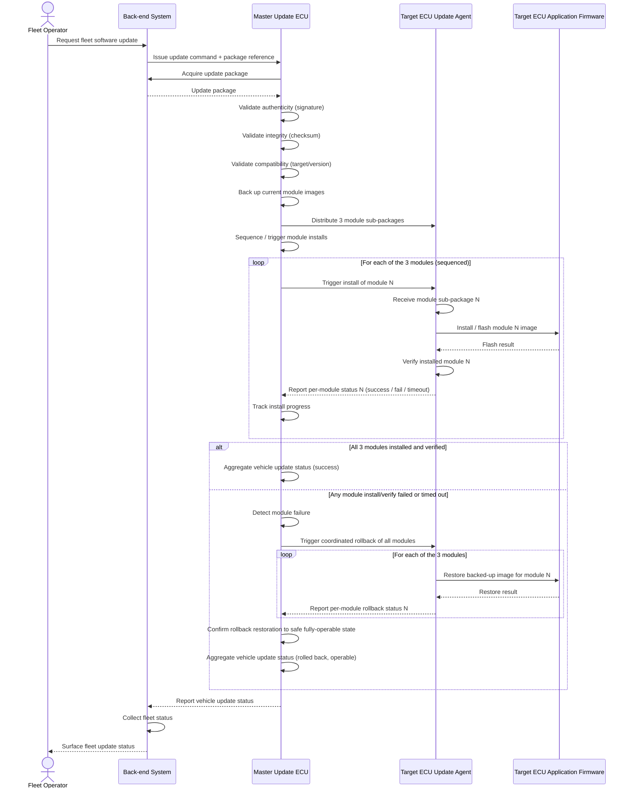

# OTA Update System — System/Subsystem Specification

## 1. Introduction

This document is the System/Subsystem Specification (SSS) for
OTA Update System. It is generated from the requirements model and
describes the system under design, its context, its capabilities, the
requirements they realise, and the processes that exercise them.

The overall Over-The-Air software update system for a customer's vehicle fleet. It spans the whole OTA chain — from the cloud back-end through the in-vehicle Master Update ECU down to the per-module update agents — and is responsible for delivering, installing, verifying, and (when needed) rolling back vehicle software while guaranteeing the vehicle never ends up non-functional.

## 2. System Description

### 2.1 System Context

This section describes the system boundary, the components that make up
the system under design, the external entities, and the interfaces
between them.

#### 2.1.1 System components (internal)

The system under design comprises the following internal components (the
umbrella plus its parts). Each may own capabilities (see §2.2).

- **OTA Update System** (`c-system-ota`, SYSTEM) — The overall Over-The-Air software update system for a customer's vehicle fleet. It spans the whole OTA chain — from the cloud back-end through the in-vehicle Master Update ECU down to the per-module update agents — and is responsible for delivering, installing, verifying, and (when needed) rolling back vehicle software while guaranteeing the vehicle never ends up non-functional.
- **Back-end System** (`c-backend`, SERVICE) — The cloud back-end of the OTA system. Hosts and manages software packages, issues update / rollback / version-revert commands on behalf of the fleet operator, and collects and surfaces update status across the fleet.
- **Master Update ECU** (`c-master-update-ecu`, SUBSYSTEM) — The dedicated in-vehicle ECU that downloads the update package, validates it, and orchestrates the multi-module installation onto the target ECUs. It backs up current images, coordinates the all-or-nothing rollback if any module fails, and reports overall vehicle update status back to the back-end. Package storage is internal to this ECU (no separate storage component).
- **Target ECU Update Agent** (`c-target-ecu-update-agent`, SUBSYSTEM) — The update software resident on each target ECU — a bootloader plus a runtime update engine. It receives its module sub-package from the Master Update ECU, installs/flashes it onto the target ECU, verifies the installed module, and can roll back its own module. Modelled as one generic component representing the role replicated across the three target modules.

#### 2.1.2 External entities

- **Fleet Operator** (`c-actor-fleet-operator`, ACTOR) — The human operator who commands software updates, rollbacks, and version reverts across the customer's vehicle fleet, and views update status. Interacts directly with the back-end.
- **Target ECU Application Firmware** (`c-ext-target-ecu-firmware`, EXTERNAL_SYSTEM) — The application software running on each target ECU — the actual firmware being replaced. It is the object/payload that the Target ECU Update Agent installs onto and can roll back. It lives on the external target-ECU host and is the thing the OTA system acts upon, so it is external to the system.

#### 2.1.3 Interfaces

| Interface | Type | Protocol | Connected components |
|---|---|---|---|
| Flash/install boundary (Update Agent–Target ECU Firmware) | OTHER | ECU flash/programming (bootloader memory programming) | Target ECU Update Agent, Target ECU Application Firmware |
| OTA network link (Back-end–Master Update ECU) | NETWORK | HTTPS/TLS over cellular | Back-end System, Master Update ECU |
| In-vehicle bus (Master Update ECU–Target ECU Update Agent) | MESSAGE_BUS | Automotive bus (e.g. CAN / Automotive Ethernet) with UDS | Master Update ECU, Target ECU Update Agent |
| Operator–Back-end console | UI | HTTPS/Web UI | Fleet Operator, Back-end System |

#### 2.1.4 Context diagram

### 2.2 Capability hierarchy

The system provides the following capabilities, organised hierarchically.
Top-level (root) capabilities are owned by the internal components of the
system under design (the capability diagram notes each root's owning
component); sub-capabilities decompose them. Only leaf capabilities carry
requirements.

- **Acquire and validate update package** (`cap-acquire-validate-package`) — owned by Master Update ECU — Download the update package from the back-end into the Master Update ECU's internal storage and validate its integrity and authenticity before any installation begins.
  - **Acquire update package** (`cap-acquire-package`) — Download the complete update package (all three module sub-packages) from the back-end into the Master Update ECU's internal storage, ready for validation.
  - **Validate package authenticity** (`cap-validate-authenticity`) — Verify the cryptographic signature of the downloaded package to confirm it originates from an authorised source and has not been forged.
  - **Validate package compatibility** (`cap-validate-compatibility`) — Confirm the package targets the correct vehicle/module configuration and version lineage (target and version compatibility) before installation is permitted.
  - **Validate package integrity** (`cap-validate-integrity`) — Verify the checksum/hash of the downloaded package to confirm it is complete and uncorrupted before installation begins.
- **Back up current module images** (`cap-backup-images`) — owned by Master Update ECU — Preserve the current working firmware image of each module before it is updated, so a previous version can be restored on rollback or revert.
- **Collect and surface fleet update status** (`cap-collect-fleet-status`) — owned by Back-end System — Gather update progress and outcome reports from across the fleet and present fleet-wide status to the operator.
- **Coordinate all-or-nothing rollback** (`cap-coordinate-rollback`) — owned by Master Update ECU — Detect a failure in any module's update and drive a coordinated rollback of every module so the vehicle returns wholly to its previous working software state (all-or-nothing).
  - **Confirm restoration to prior working state** (`cap-confirm-rollback-restoration`) — Collect each module's rollback outcome and confirm the vehicle has been wholly restored to its previous working software state before declaring the update aborted.
  - **Detect any-module update failure** (`cap-detect-module-failure`) — Detect a failed install or verification in any one of the three modules (or a timeout / missing report) that must trigger a coordinated rollback.
  - **Trigger coordinated all-or-nothing rollback** (`cap-trigger-coordinated-rollback`) — On detecting any module failure, command every module's agent to roll back to its previous working image so the whole vehicle reverts together (all-or-nothing).
- **Fail-safe operability (never non-functional)** (`cap-fail-safe-operability`) — owned by OTA Update System — The cross-cutting safety property that the vehicle software must NEVER end up non-functional as a result of an update. Broader than rollback: it covers power-loss and interruption tolerance during flashing, A/B partition / dual-bank schemes, and safe defaults so the vehicle always retains a working software set. Owned by the umbrella because it spans the whole OTA chain.
  - **Maintain A/B (dual-bank) software partitions** (`cap-dual-bank-partitioning`) — Hold the running software in one bank while writing the update to an inactive bank, switching banks only once the new image is validated, so a known-good software set is always retained.
  - **Guarantee a working software set via safe defaults** (`cap-guarantee-working-software-set`) — Ensure that on any abort, failure, or undefined state the vehicle falls back to a complete, mutually-compatible, known-good software set (safe defaults), so it is never left non-functional.
  - **Tolerate power loss and interruption during flashing** (`cap-tolerate-power-interruption`) — Withstand power loss, communication drops, or other interruptions at any point during flashing such that the vehicle is never left with a corrupt or partial software set, and the in-progress operation can be safely resumed or aborted.
- **Issue update, rollback and version-revert commands** (`cap-issue-commands`) — owned by Back-end System — On behalf of the fleet operator, dispatch update, rollback, and previous-version-revert commands to the targeted vehicles in the fleet.
- **Manage software versions** (`cap-manage-versions`) — owned by Back-end System — Track which software version is deployed per vehicle/module and maintain the catalogue of versions available, enabling the operator to revert to a previous version.
  - **Maintain catalogue of available versions** (`cap-maintain-version-catalogue`) — Maintain the catalogue of software versions available for deployment and revert, recording version lineage so the operator can select a previous version to revert to.
  - **Track deployed version per vehicle and module** (`cap-track-deployed-versions`) — Maintain an accurate record of which software version is currently deployed on each vehicle and each of its modules.
- **Manage and host software packages** (`cap-manage-packages`) — owned by Back-end System — Store, organise, and serve the OTA update packages (each comprising three per-module sub-packages) so they can be delivered to vehicles.
- **Orchestrate multi-module installation** (`cap-orchestrate-install`) — owned by Master Update ECU — Coordinate the separate installation of each of the three module sub-packages via the Target ECU Update Agents, tracking per-module progress to completion.
  - **Distribute module sub-packages** (`cap-distribute-subpackages`) — Dispatch each of the three module sub-packages to its respective Target ECU Update Agent over the in-vehicle bus.
  - **Sequence and coordinate per-module installs** (`cap-sequence-module-installs`) — Drive the separate installation of each module sub-package by its agent in the correct order, honouring inter-module dependencies and constraints.
  - **Track per-module installation progress** (`cap-track-install-progress`) — Track the install/verify progress and outcome of each of the three modules to determine when the overall multi-module update has completed successfully.
- **Install / flash module firmware** (`cap-install-module`) — owned by Target ECU Update Agent — Install (flash) the received sub-package as the new application firmware on the target ECU.
- **Receive module sub-package** (`cap-receive-module-subpackage`) — owned by Target ECU Update Agent — Receive this module's sub-package from the Master Update ECU over the in-vehicle bus, ready for installation.
- **Report module status** (`cap-report-module-status`) — owned by Target ECU Update Agent — Report this module's install/verify/rollback progress and outcome back to the Master Update ECU.
- **Report vehicle update status** (`cap-report-vehicle-status`) — owned by Master Update ECU — Aggregate per-module outcomes into an overall vehicle update status and report it to the back-end.
- **Roll back module firmware** (`cap-rollback-module`) — owned by Target ECU Update Agent — Restore this module's previous working firmware image on command, as part of a coordinated all-or-nothing rollback or an operator-requested version revert.
- **Verify installed module** (`cap-verify-module`) — owned by Target ECU Update Agent — Verify the integrity and correct operation of the freshly installed module firmware before it is accepted.

### 2.3 Capability diagram

```mermaid
graph TD
  cap_acquire_validate_package["Acquire and validate update package<br/>(Master Update ECU)"]
  cap_acquire_validate_package --> cap_acquire_package["Acquire update package"]
  cap_acquire_validate_package --> cap_validate_authenticity["Validate package authenticity"]
  cap_acquire_validate_package --> cap_validate_compatibility["Validate package compatibility"]
  cap_acquire_validate_package --> cap_validate_integrity["Validate package integrity"]
  cap_backup_images["Back up current module images<br/>(Master Update ECU)"]
  cap_collect_fleet_status["Collect and surface fleet update status<br/>(Back-end System)"]
  cap_coordinate_rollback["Coordinate all-or-nothing rollback<br/>(Master Update ECU)"]
  cap_coordinate_rollback --> cap_confirm_rollback_restoration["Confirm restoration to prior working state"]
  cap_coordinate_rollback --> cap_detect_module_failure["Detect any-module update failure"]
  cap_coordinate_rollback --> cap_trigger_coordinated_rollback["Trigger coordinated all-or-nothing rollback"]
  cap_fail_safe_operability["Fail-safe operability (never non-functional)<br/>(OTA Update System)"]
  cap_fail_safe_operability --> cap_dual_bank_partitioning["Maintain A/B (dual-bank) software partitions"]
  cap_fail_safe_operability --> cap_guarantee_working_software_set["Guarantee a working software set via safe defaults"]
  cap_fail_safe_operability --> cap_tolerate_power_interruption["Tolerate power loss and interruption during flashing"]
  cap_issue_commands["Issue update, rollback and version-revert commands<br/>(Back-end System)"]
  cap_manage_versions["Manage software versions<br/>(Back-end System)"]
  cap_manage_versions --> cap_maintain_version_catalogue["Maintain catalogue of available versions"]
  cap_manage_versions --> cap_track_deployed_versions["Track deployed version per vehicle and module"]
  cap_manage_packages["Manage and host software packages<br/>(Back-end System)"]
  cap_orchestrate_install["Orchestrate multi-module installation<br/>(Master Update ECU)"]
  cap_orchestrate_install --> cap_distribute_subpackages["Distribute module sub-packages"]
  cap_orchestrate_install --> cap_sequence_module_installs["Sequence and coordinate per-module installs"]
  cap_orchestrate_install --> cap_track_install_progress["Track per-module installation progress"]
  cap_install_module["Install / flash module firmware<br/>(Target ECU Update Agent)"]
  cap_receive_module_subpackage["Receive module sub-package<br/>(Target ECU Update Agent)"]
  cap_report_module_status["Report module status<br/>(Target ECU Update Agent)"]
  cap_report_vehicle_status["Report vehicle update status<br/>(Master Update ECU)"]
  cap_rollback_module["Roll back module firmware<br/>(Target ECU Update Agent)"]
  cap_verify_module["Verify installed module<br/>(Target ECU Update Agent)"]
```

## 3. Requirements

### 3.1 Functional requirements

Grouped by realising leaf capability.

#### Acquire update package (`cap-acquire-package`)

- **Acquire the update package** (`req-acquire-package`, priority HIGH) — The system shall acquire the complete software update package from the back-end before beginning validation and installation.

#### Back up current module images (`cap-backup-images`)

- **Back up current module images** (`req-backup-images`, priority CRITICAL) — The system shall create a recoverable backup of the current firmware image of every target module before initiating any module installation.

#### Collect and surface fleet update status (`cap-collect-fleet-status`)

- **Collect and surface fleet update status** (`req-collect-fleet-status`, priority MEDIUM) — The system shall collect the vehicle update status reported by each Master Update ECU and surface the aggregated fleet update status to the fleet operator.

#### Confirm restoration to prior working state (`cap-confirm-rollback-restoration`)

- **Confirm restoration to safe operable state** (`req-confirm-rollback-restoration`, priority CRITICAL) — The system shall confirm, after a coordinated rollback, that every target module has been restored to its backed-up image and that the vehicle is in a fully operable state.

#### Detect any-module update failure (`cap-detect-module-failure`)

- **Detect module install or verification failure** (`req-detect-module-failure`, priority CRITICAL) — The system shall detect when any target module install or verification fails or does not complete within its configured timeout.

#### Distribute module sub-packages (`cap-distribute-subpackages`)

- **Distribute per-module sub-packages** (`req-distribute-subpackages`, priority HIGH) — The system shall distribute the corresponding module sub-package to the Target ECU Update Agent for each of the three target modules.

#### Install / flash module firmware (`cap-install-module`)

- **Install module firmware image** (`req-install-module`, priority HIGH) — The system shall install the received module image onto the target ECU application firmware when triggered by the Master Update ECU.

#### Issue update, rollback and version-revert commands (`cap-issue-commands`)

- **Issue update command to Master Update ECU** (`req-issue-update-command`, priority HIGH) — The system shall, upon an authenticated fleet-operator update request, issue an update command identifying the target package to the Master Update ECU of each selected vehicle.

#### Manage and host software packages (`cap-manage-packages`)

- **Serve the requested update package** (`req-serve-update-package`, priority HIGH) — The system shall make the requested software update package available to the Master Update ECU for acquisition when an update command is issued.

#### Receive module sub-package (`cap-receive-module-subpackage`)

- **Receive module sub-package** (`req-receive-module-subpackage`, priority HIGH) — The system shall receive the module sub-package distributed by the Master Update ECU for the module it is responsible for.

#### Report module status (`cap-report-module-status`)

- **Report per-module status** (`req-report-module-status`, priority HIGH) — The system shall report the install, verification, or rollback status of its module to the Master Update ECU.

#### Report vehicle update status (`cap-report-vehicle-status`)

- **Report aggregated vehicle update status** (`req-report-vehicle-status`, priority HIGH) — The system shall aggregate the per-module outcomes into an overall vehicle update status and report it to the back-end at the conclusion of the update.

#### Roll back module firmware (`cap-rollback-module`)

- **Roll back module to backed-up image** (`req-rollback-module`, priority CRITICAL) — The system shall, when commanded to roll back, restore the backed-up firmware image for its module onto the target ECU application firmware.

#### Sequence and coordinate per-module installs (`cap-sequence-module-installs`)

- **Sequence and trigger module installs** (`req-sequence-module-installs`, priority HIGH) — The system shall sequence and trigger the installation of the three target modules according to the defined install order.

#### Track per-module installation progress (`cap-track-install-progress`)

- **Track per-module install progress** (`req-track-install-progress`, priority MEDIUM) — The system shall track the install progress and outcome of each target module throughout the update.

#### Trigger coordinated all-or-nothing rollback (`cap-trigger-coordinated-rollback`)

- **Trigger all-or-nothing coordinated rollback** (`req-trigger-coordinated-rollback`, priority CRITICAL) — The system shall, upon detection of any module install or verification failure, trigger a coordinated rollback of all three target modules.

#### Validate package authenticity (`cap-validate-authenticity`)

- **Validate package authenticity** (`req-validate-authenticity`, priority CRITICAL) — The system shall verify the cryptographic signature of the acquired update package and reject the package if the signature is invalid.

#### Validate package compatibility (`cap-validate-compatibility`)

- **Validate package compatibility** (`req-validate-compatibility`, priority HIGH) — The system shall verify that the update package targets the correct ECU modules and version baseline of the vehicle and reject the package if it is incompatible.

#### Validate package integrity (`cap-validate-integrity`)

- **Validate package integrity** (`req-validate-integrity`, priority CRITICAL) — The system shall verify the checksum of the acquired update package and reject the package if the computed checksum does not match the expected value.

#### Verify installed module (`cap-verify-module`)

- **Verify installed module** (`req-verify-module`, priority HIGH) — The system shall verify the installed module image on the target ECU application firmware after each install and report the verification outcome.

### 3.2 Non-functional requirements

Grouped by realising leaf capability.

#### Detect any-module update failure (`cap-detect-module-failure`)

- **Bound module install/verify wait time** (`req-detect-module-timeout`, priority HIGH) — The system shall treat a target module whose install or verification has not reported completion within its configured per-module timeout as a failed module.

### 3.3 Constraints

Grouped by realising leaf capability.

#### Confirm restoration to prior working state (`cap-confirm-rollback-restoration`)

- **Never leave the vehicle non-functional** (`req-never-non-functional`, priority CRITICAL) — The system shall ensure that at the conclusion of any update attempt the vehicle is left running either the complete new software set or the complete previously installed software set, and shall never leave the vehicle in a non-functional or partially updated state.
  - Rationale: All-or-nothing safety guarantee — the core promise of the OTA system.
  - Acceptance criteria:
    - After a successful update, all three modules run the new image set.
    - After a rolled-back update, all three modules run the previous image set.
    - No outcome leaves a mix of new and old module images on the vehicle.

## 4. Processes

Each process below describes a system-level interaction. Participants are
the internal components of the system under design whose capabilities the
process exercises, plus the external entities they interact with
(derived per metamodel §4a).

### OTA software update with all-or-nothing rollback (`proc-ota-update`)

An operator-initiated over-the-air software update of a vehicle's three target ECU modules. The back-end issues the update command; the Master Update ECU acquires and validates the package (authenticity, integrity, compatibility), backs up the current module images, then distributes per-module sub-packages to the Target ECU Update Agent and sequences the installs. The agent installs, verifies, and reports per-module status while the Master ECU tracks progress. If any module install or verification fails or times out, the Master ECU detects the failure and triggers a coordinated all-or-nothing rollback: the agent restores every backed-up image and the Master ECU confirms restoration to a safe, fully-operable state, so the vehicle is never left non-functional. Either way, the Master ECU aggregates and reports vehicle status up to the back-end, which collects fleet status and surfaces it to the operator.

Activated capabilities:

- Acquire update package (`cap-acquire-package`)
- Back up current module images (`cap-backup-images`)
- Collect and surface fleet update status (`cap-collect-fleet-status`)
- Confirm restoration to prior working state (`cap-confirm-rollback-restoration`)
- Detect any-module update failure (`cap-detect-module-failure`)
- Distribute module sub-packages (`cap-distribute-subpackages`)
- Install / flash module firmware (`cap-install-module`)
- Issue update, rollback and version-revert commands (`cap-issue-commands`)
- Manage and host software packages (`cap-manage-packages`)
- Receive module sub-package (`cap-receive-module-subpackage`)
- Report module status (`cap-report-module-status`)
- Report vehicle update status (`cap-report-vehicle-status`)
- Roll back module firmware (`cap-rollback-module`)
- Sequence and coordinate per-module installs (`cap-sequence-module-installs`)
- Track per-module installation progress (`cap-track-install-progress`)
- Trigger coordinated all-or-nothing rollback (`cap-trigger-coordinated-rollback`)
- Validate package authenticity (`cap-validate-authenticity`)
- Validate package compatibility (`cap-validate-compatibility`)
- Validate package integrity (`cap-validate-integrity`)
- Verify installed module (`cap-verify-module`)

## 5. Traceability

The matrix maps capabilities to the requirements that realise them.

| Leaf capability | Requirement(s) (via `REALIZED_BY`) |
|---|---|
| Acquire update package (`cap-acquire-package`) | Acquire the update package (`req-acquire-package`) |
| Back up current module images (`cap-backup-images`) | Back up current module images (`req-backup-images`) |
| Collect and surface fleet update status (`cap-collect-fleet-status`) | Collect and surface fleet update status (`req-collect-fleet-status`) |
| Confirm restoration to prior working state (`cap-confirm-rollback-restoration`) | Confirm restoration to safe operable state (`req-confirm-rollback-restoration`); Never leave the vehicle non-functional (`req-never-non-functional`) |
| Detect any-module update failure (`cap-detect-module-failure`) | Detect module install or verification failure (`req-detect-module-failure`); Bound module install/verify wait time (`req-detect-module-timeout`) |
| Distribute module sub-packages (`cap-distribute-subpackages`) | Distribute per-module sub-packages (`req-distribute-subpackages`) |
| Install / flash module firmware (`cap-install-module`) | Install module firmware image (`req-install-module`) |
| Issue update, rollback and version-revert commands (`cap-issue-commands`) | Issue update command to Master Update ECU (`req-issue-update-command`) |
| Manage and host software packages (`cap-manage-packages`) | Serve the requested update package (`req-serve-update-package`) |
| Receive module sub-package (`cap-receive-module-subpackage`) | Receive module sub-package (`req-receive-module-subpackage`) |
| Report module status (`cap-report-module-status`) | Report per-module status (`req-report-module-status`) |
| Report vehicle update status (`cap-report-vehicle-status`) | Report aggregated vehicle update status (`req-report-vehicle-status`) |
| Roll back module firmware (`cap-rollback-module`) | Roll back module to backed-up image (`req-rollback-module`) |
| Sequence and coordinate per-module installs (`cap-sequence-module-installs`) | Sequence and trigger module installs (`req-sequence-module-installs`) |
| Track per-module installation progress (`cap-track-install-progress`) | Track per-module install progress (`req-track-install-progress`) |
| Trigger coordinated all-or-nothing rollback (`cap-trigger-coordinated-rollback`) | Trigger all-or-nothing coordinated rollback (`req-trigger-coordinated-rollback`) |
| Validate package authenticity (`cap-validate-authenticity`) | Validate package authenticity (`req-validate-authenticity`) |
| Validate package compatibility (`cap-validate-compatibility`) | Validate package compatibility (`req-validate-compatibility`) |
| Validate package integrity (`cap-validate-integrity`) | Validate package integrity (`req-validate-integrity`) |
| Verify installed module (`cap-verify-module`) | Verify installed module (`req-verify-module`) |

---
